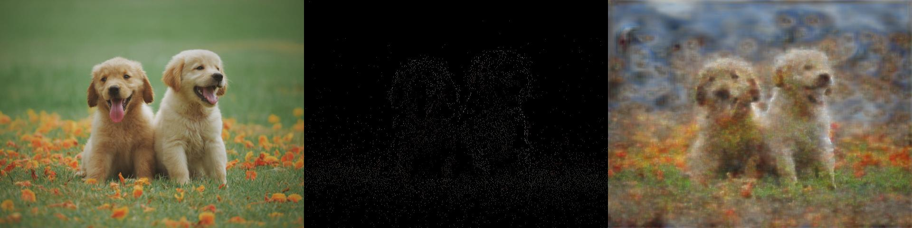
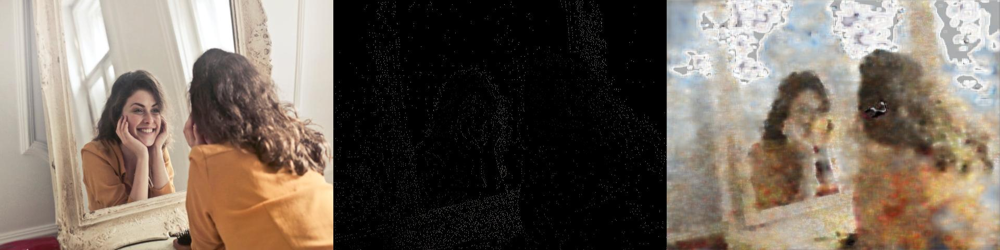
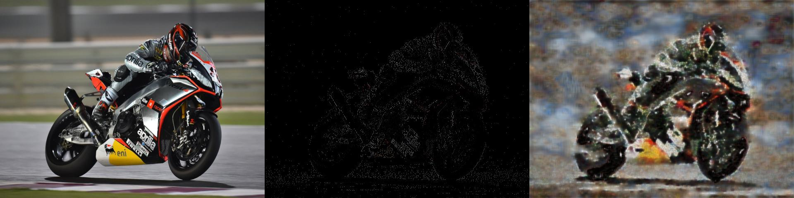

# Druma One — Shattering the Point‑Detection Speed Barrier

> **Over 690 FPS · 6000+ stable key‑points detection per VGA frame · Runs on a laptop GPU ( RTX 1060 Mobile) **
> No other public system pairs *this* density with *this* latency. Below you’ll find reproducible benchmarks, dense‑flow demos, and a reconstruction teaser that proves the geometry we keep is good enough to rebuild the whole scene.

Assets only – no code in this repository.

## Druma One Optical Flow – Point detection + dense motion

  

The colours encode **direction** using a standard HSV flow wheel:

* **Yellow →** left-ward pixel motion (camera panning right)  
* **Orange →** right-ward pixel motion  
* **Green →** upward motion  
* **Red →** downward motion  

### How to read the demos

* **Hand-held clip (above).**  Minute tremors in the operator’s hand nudge the whole scene by a few pixels.  
  As the phone tilts right, desk objects tint **yellow** (flow left). When the phone tilts back, hues flip to **orange/red**, proving Druma One tracks even subtle shake.

* **Drone-valley clip (below).**  The quadcopter flies forward through a narrow valley.  
  Points at the valley floor move **downward** in the image as they get closer → **red**.  
  Left cliff marches right-to-left → **yellow**. Right cliff creeps left-to-right → **orange**.  
  The radial colour gradient intuitively conveys depth as well as direction.

  

* **Traffic-flow clip (below).**  The camera is fixed; only objects move.  
  Cars in the left lane travel right-to-left → **yellow**, while cars in the right lane travel left-to-right → **orange**.  
  Static background (road surface, distant buildings), illustrating Druma One’s zero-drift flow on a locked-off shot.

  

📹 Download the full-res demos in the videos/ folder.

---
## 🖼️ Point-Only Auto-Encoder Reconstruction

 Left → ground truth · Centre → Druma One key-points · Right → VGG-16 AE reconstruction

 Left → ground truth · Centre → Druma One key-points · Right → VGG-16 AE reconstruction

 Left → ground truth · Centre → Druma One key-points · Right → VGG-16 AE reconstruction

Even fed *only* the detector’s point cloud, a 16-epoch VGG-16 auto-encoder recovers global colour, shape and lighting—proof that Druma One’s geometry is rich enough for downstream contrastive or generative tasks.

 
---

## 📦 What’s Included

| Folder               | Contents                                                                 |
|----------------------|--------------------------------------------------------------------------|
| `benchmarks/`        | PDF report: Druma One vs SuperPoint on 4 GPUs (same 640 × 480 clip)      |
| `reconstructions/`   | Hand-picked set of triplets: ground truth, Druma One keypoints, AE output |
| `videos/`            | Three short clips: traffic, drone orbit, handheld walk                   |
| `gifs/`              | Gifs of the vidoes to be displayed in this readme                        |
| `README.md`          | This overview                                                            |
| `LICENSE`            | Druma.ai Evaluation‑Content Licence v1.0   

Need binaries, API keys, or ASIC RTL?  Please contact me at **[nissim@druma.ai](mailto:nissim@druma.ai)**.

---

## ⚙️ Benchmark snapshot (640 × 480 × 3)

| GPU             | SuperPoint FPS | SuperPoint pts (avg) | **Druma One FPS** | **Druma One pts (avg)** |
| --------------- | -------------: | -------------------: | ----------------: | ----------------------: |
| RTX 1060 Mobile |           32.09 |                  601.79 |       **694.5** |               **6839.65** |
| RTX 2070        |           45.36 |                  601.79 |      **1009.95** |               **6836.74** |
| RTX 3050 Mobile |           35.7 |                  599.99 |       **1079.04** |               **6836.74** |
| RTX 4070 Super  |           79.15 |                  601.61 |        **1145** |               **6836.74** |

---

## 🚀 What you can build right now

* **Autonomous driving & ADAS** – leverage the built‑in DO‑Flow for visual‑only odometry, dense landmarking for lane keeping and obstacle buffering.
* **Robotics & drones** – plug Druma One straight into a SLAM front‑end.
* **AR / VR / XR** – sub‑frame inside‑out tracking plus fine‑grained hand‑gesture points that go far beyond conventional 17‑joint skeletons.
* **Surveillance & anomaly detection** – dense geometry lets lightweight models flag unusual motion or misplaced objects *even without* explicit flow.
* **Research tooling** – feed the point cloud into self‑supervised pipelines, texture‑similarity search or generative reconstruction tasks.
* **Scene embeddings & loop-closure** – pipe the point cloud through our lightweight VGG16 auto-encoder to get a 512-D scene hash; perfect for place recognition, texture-similarity search or low-bandwidth map updates.

---

## 🔒 Licence & usage

All assets in this repository are released under the **Druma.ai Evaluation‑Content Licence v1.0** (see `LICENSE`).

* **Allowed** — download, view, cite with attribution.
* **Not allowed** — redistribute, train models on, or deploy commercially without written permission.

For evaluation access or production licences, email **[nissim@druma.ai](mailto:nissim@druma.ai)**.

---

*Made with ❤️ by **Nissim · Druma.ai***
